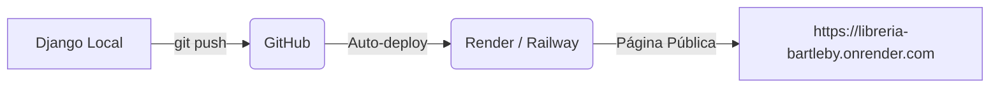

# 🚀 Manual de Despliegue en Internet: Librería Bartleby

Este manual describe paso a paso cómo subir tu aplicación Django a producción en internet utilizando la metodología moderna de Integración Continua (CI/CD):



---

## 🛠️ ¿Qué acabo de configurar en tu proyecto?

Para facilitarte la vida al 100%, acabo de dejar tu código totalmente listo para producción. He realizado los siguientes cambios:
1. **`build.sh` (Script de Compilación)**: Archivo en la raíz que se encarga de instalar librerías, aplicar migraciones a la base de datos y recolectar las hojas de estilo y scripts automáticamente.
2. **`config/settings.py` (Ajustes de Producción)**:
   * **WhiteNoise**: Middleware configurado para servir y comprimir los archivos estáticos en segundos.
   * **`dj-database-url`**: Capacidad para detectar automáticamente el enlace de conexión de la base de datos PostgreSQL en internet.
3. **`requirements.txt`**: Agregadas las dependencias de producción (`gunicorn`, `whitenoise`, `dj-database-url`).

---

## 📋 Variables de Entorno Requeridas

Al subir tu app a Render o Railway, debes copiar los valores de tu archivo `.env` local en la sección **Environment Variables** del panel web de la plataforma.

| Variable | Valor Recomendado | Propósito |
| :--- | :--- | :--- |
| `SECRET_KEY` | *(Usa una clave larga y secreta)* | Seguridad de la aplicación |
| `DEBUG` | `False` | Ocultar errores técnicos a los usuarios |
| `ALLOWED_HOSTS` | `*` o tu URL pública (ej: `libreria-bartleby.onrender.com`) | Dominios permitidos |
| `EMAIL_BACKEND` | `django.core.mail.backends.smtp.EmailBackend` | Servicio de correos SMTP |
| `EMAIL_HOST` | `smtp-relay.brevo.com` | Servidor de correos Brevo |
| `EMAIL_PORT` | `587` | Puerto SMTP TLS |
| `EMAIL_USE_TLS` | `True` | Conexión segura encriptada |
| `EMAIL_HOST_USER` | `acc484001@smtp-brevo.com` | Tu usuario de inicio de sesión de Brevo |
| `EMAIL_HOST_PASSWORD` | `xsmtpsib-...` *(Tu llave SMTP activa)* | Tu contraseña SMTP de Brevo |
| `DEFAULT_FROM_EMAIL` | `eln1ggas00@gmail.com` | Correo remitente verificado |

> [!NOTE]
> La variable `DATABASE_URL` la genera **automáticamente** Render o Railway cuando creas y vinculas una base de datos PostgreSQL, por lo que no necesitas ingresarla a mano.

---

## 🚶‍♂️ Paso a Paso: Del Computador a Internet

### Paso 1: Guardar tus cambios en Git
Abre tu consola local en el directorio del proyecto y ejecuta estos comandos para registrar tu código:
```bash
git add .
git commit -m "preparar configuracion para despliegue de produccion"
```

### Paso 2: Crear un repositorio en GitHub
1. Entra a [GitHub](https://github.com/) e inicia sesión.
2. Crea un **Nuevo Repositorio** (puedes ponerlo como **Private** para proteger tu código).
3. Sube tu código de la consola ejecutando:
   ```bash
   git branch -M main
   git remote add origin https://github.com/TU_USUARIO/TU_REPOSITORIO.git
   git push -u origin main
   ```

---

### Paso 3: Desplegar en Render (Opción Recomendada y Gratis)

1. **Crear Base de Datos PostgreSQL**:
   * En tu cuenta de [Render](https://render.com/), haz clic en **New** ➔ **PostgreSQL**.
   * Ponle un nombre (ej. `bartleby-db`) y haz clic en **Create Database**.
   * Una vez creada, copia la **Internal Database URL** que te da Render.

2. **Crear el Servicio Web**:
   * En Render, haz clic en **New** ➔ **Web Service**.
   * Conecta tu cuenta de GitHub y selecciona el repositorio de la librería.
   * Configura las siguientes opciones:
     * **Language**: `Python`
     * **Region**: *(La más cercana a ti)*
     * **Branch**: `main`
     * **Build Command**: `./build.sh` (este script instalará todo y aplicará las migraciones).
     * **Start Command**: `gunicorn config.wsgi:application` (el servidor de producción).
     * **Plan**: `Free` (Gratuito).

3. **Configurar Variables**:
   * Ve a la pestaña **Environment** en el panel de tu Web Service en Render.
   * Haz clic en **Add Environment Variable** e ingresa todas las variables de la tabla anterior.
   * **Muy importante**: Agrega una variable llamada `DATABASE_URL` y pégale la URL interna de la base de datos PostgreSQL que copiaste en el paso anterior.
   * Haz clic en **Save Changes**.

---

### Paso 4: Desplegar en Railway (Alternativa Ultra-Rápida)

1. Entra a [Railway.app](https://railway.app/) y crea un proyecto.
2. Haz clic en **New** ➔ **GitHub Repo** y selecciona tu repositorio.
3. Railway te preguntará si quieres agregar una base de datos. Selecciona **PostgreSQL**.
4. Ve a la pestaña de **Variables** de tu Web Service e ingresa las variables de entorno de la tabla.
5. **Configura el comando de arranque**: En los ajustes del servicio, define el comando de compilación como `./build.sh` y el de arranque como `gunicorn config.wsgi:application`.

---

## 🔄 ¿Cómo hacer "Actualizaciones"?

Una vez desplegado en Render o Railway, el proceso para actualizar tu página es el más sencillo del mundo.

Cuando decidas hacer un cambio en tu código local (por ejemplo, cambiar un botón o el color del diseño):

1. **Guardas los cambios en tu computadora**:
   ```bash
   git add .
   git commit -m "cambiado el color de la cabecera"
   ```
2. **Subes los cambios a GitHub**:
   ```bash
   git push
   ```

**¡Y listo!** Render o Railway detectarán automáticamente que subiste un cambio a GitHub, descargarán el código nuevo, ejecutarán `./build.sh` en la nube para actualizar la base de datos y tus archivos estáticos, y en menos de 2 minutos tu página web estará actualizada con los últimos cambios de manera 100% automática y sin apagar el sitio.
